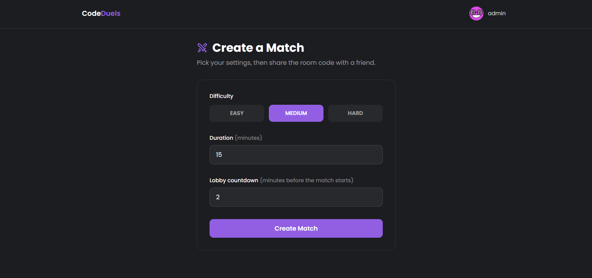
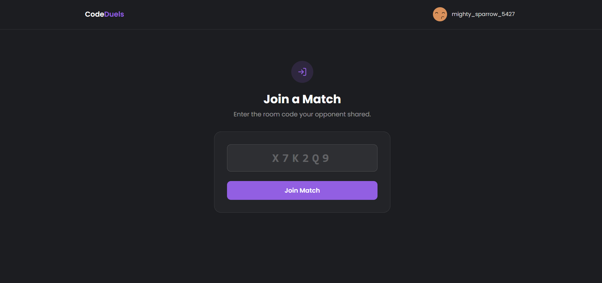
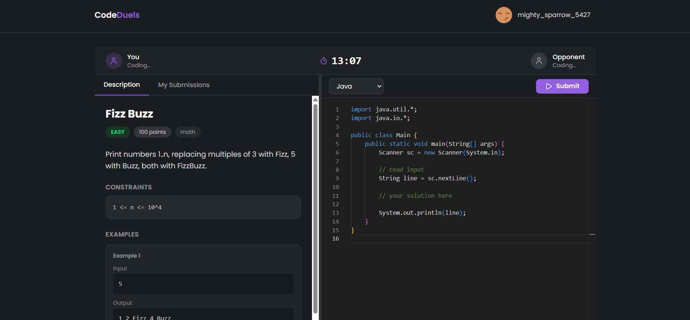
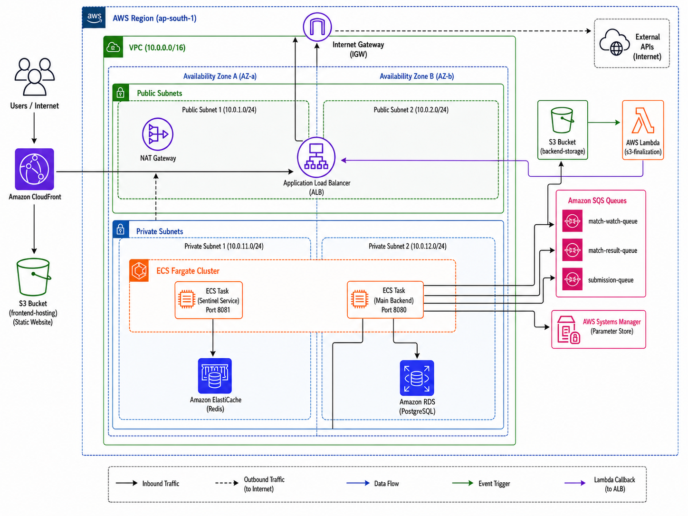
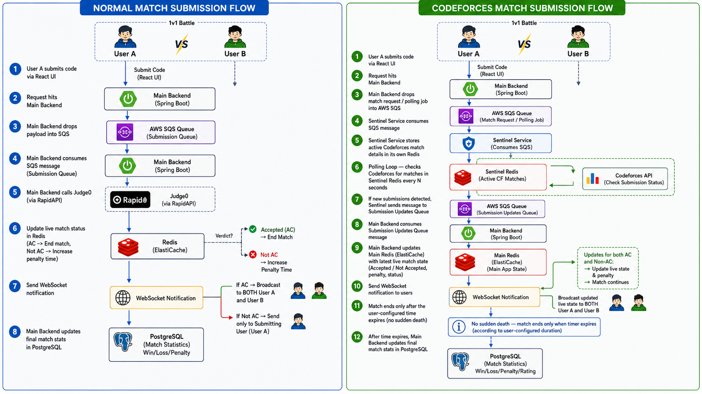

# CodeDuels — Real-Time 1v1 Competitive Programming Platform

CodeDuels is a full-stack platform where two developers race to solve the same
problem first. Matches run on a live timer with real-time opponent tracking,
sandboxed code execution, and a penalty-based scoring system.

Built to explore production backend patterns end to end: asynchronous job
processing, WebSocket communication, permission-based authorization, object
storage, caching, and rate limiting.

---

## Table of Contents

- [Screenshots](#screenshots)
- [How a Duel Works](#how-a-duel-works)
- [Architecture Overview](#architecture-overview)
- [Submission Flow](#submission-flow)
- [Backend](#backend)
- [Frontend](#frontend)
- [Core Features](#core-features)
- [Security](#security)
- [Performance & Reliability](#performance--reliability)
- [Tech Stack](#tech-stack)
- [Local Development](#local-development)
- [Roadmap](#roadmap)

---

## Screenshots

<!-- add screenshots here -->



---

## How a Duel Works

1. A player creates a match — difficulty, duration, and a lobby countdown.
2. They share the generated room code with an opponent.
3. When the opponent joins, both players see a synchronized countdown.
4. A scheduler picks a random published problem **neither player has solved
   before** and starts the match. Both screens reveal the problem at the same
   instant.
5. Players submit code. Each wrong answer adds a five-minute time penalty.
6. The first accepted solution ends the match. If nobody solves it before the
   timer expires, the match is a draw.
7. The winner is decided by **effective time**:
   `(finish time − start time) + penalties × 5 minutes`

---

## Architecture Overview

<!-- architecture diagram here -->



The Spring Boot backend exposes a REST API and a STOMP WebSocket endpoint.
Every client action is an HTTP request; every consequence arrives as a
server-initiated push.

Code execution is decoupled from the request thread: a submission is persisted,
enqueued to AWS SQS, and acknowledged immediately with `202 Accepted`. A queue
listener in the same application picks the message up, runs the code through a
self-hosted Judge0 instance, and pushes the verdict back over WebSocket.

Hidden test cases live in S3 as zip archives, uploaded directly from the client
via presigned URLs. Parsed test cases are cached in Redis so repeated
submissions against the same problem skip the download and unzip entirely.

---

## Submission Flow

<!-- submission flow diagram here -->



1. The player submits code from the Monaco editor.
2. The backend validates the problem is published, the match is active, the
   caller is a participant, and the problem belongs to that match.
3. A rate limiter (token bucket, backed by Redis) caps submissions per user.
4. The submission is saved as `PENDING` and the request returns immediately with
   a submission id.
5. After the database transaction commits, a message is published to SQS.
6. A queue listener consumes it and marks the submission `PROCESSING`.
7. Sample and hidden test cases are assembled — hidden cases downloaded from S3
   and unzipped, or served from the Redis cache on a hit.
8. Judge0 runs the code as a batch against every test case; the service polls
   until all results are terminal, then aggregates them into a single verdict.
9. The verdict is persisted and handed to the match module, which either
   increments the player's penalty count or records their finish time and
   completes the match.
10. Two WebSocket pushes go out: the verdict to the submitter (`stdout`,
    `stderr`, runtime), and the updated scoreboard to both players.
11. Final statistics are persisted to PostgreSQL when the match concludes.

**Design rationale:** judging takes several seconds. Running it inline would tie
up an HTTP thread per submission and lose work on a crash. The queue keeps the
API responsive, absorbs bursts, and redelivers messages when a worker fails.

---

## Backend

Java 21 · Spring Boot 3 · Spring Security · Spring Data JPA · Spring WebSocket

Organised as a modular monolith — feature modules (`auth`, `user`, `problem`,
`submission`, `match`) with cross-module references by id rather than JPA
relations, so any module could be extracted into its own service later.

**Responsibilities**

- JWT authentication with refresh-token rotation
- Role- and permission-based authorization
- Problem authoring, presigned S3 uploads, and publication workflow
- Match lifecycle: create, join, scheduled start, live scoreboard, completion
- Asynchronous judging via SQS and Judge0
- STOMP broadcasts for every match and submission event
- Scheduled jobs for match start, timeout, and lobby cleanup

**Timing is server-owned.** The client displays a countdown, but the backend
decides when a match starts (a scheduler polling for due matches) and when it
ends (a sweeper completing overdue matches, plus a lazy check on read).

---

## Frontend

React 19 · Vite · TypeScript · Tailwind CSS v4 · shadcn/ui · Monaco Editor ·
StompJS · TanStack Query

Feature-based structure mirroring the backend modules.

**The real-time pattern:** each match page fetches a state snapshot once on
mount and subscribes to `/topic/match/{matchId}`. Incoming events patch the
same TanStack Query cache entry the snapshot filled, so components re-render
without knowing whether HTTP or a WebSocket produced the change. The page
renders whichever screen the match status calls for — lobby, arena, or results —
and switches automatically as the server advances that status.

Code is cached in `localStorage` per match, so a refresh mid-duel doesn't lose
work.

---

## Core Features

**Players**
- Email/password authentication with JWT
- Match creation with difficulty, duration, and lobby countdown
- Join by room code or invite link
- Monaco editor with Python, Java, C++, and JavaScript
- Live opponent progress: penalties and solve status
- Synchronized match timer
- Submission history with per-attempt verdicts
- Post-match results: effective times, penalties, and a submission timeline
- Match history and win/loss/draw stats

**Admins**
- Permission-gated problem creation
- Presigned S3 upload for hidden test cases
- Finalization endpoint that verifies the upload and publishes the problem
- Draft problems invisible to players until published

**System**
- Asynchronous judging through SQS
- Sandboxed execution via self-hosted Judge0
- Hidden test cases in S3, parsed results cached in Redis
- Per-user rate limiting with Bucket4j over Redis
- Scheduled match start, timeout, and abandoned-lobby cleanup

---

## Security

**Authentication & authorization**
- Stateless JWT with short-lived access tokens and DB-anchored refresh tokens
- Roles bundle fine-grained permissions; endpoints declare capabilities rather
  than role names
- WebSocket connections authenticate on the STOMP `CONNECT` frame, and
  subscriptions to a match topic are rejected for non-participants

**Anti-cheating**
- Judging runs against hidden test cases stored server-side, never exposed
- Submissions are readable only by their author
- Opponents see penalty counts, never verdicts, error output, or code
- Problem selection excludes anything either player has already solved
- Draft problems return 404 rather than 403, so their existence isn't confirmed

**Other**
- BCrypt password hashing
- Uniform "invalid credentials" responses to prevent user enumeration
- Rate limiting on submissions
- Bean validation at the request boundary
- Presigned uploads scoped to a single object key with a short expiry

---

## Performance & Reliability

**Asynchronous processing** — judging is decoupled from the request thread, so a
burst of submissions queues rather than exhausting the thread pool. Failed
processing is redelivered by SQS instead of being lost.

**Caching** — parsed test cases are cached in Redis with a TTL and explicit
eviction when a problem's test data changes, avoiding an S3 download and unzip
on every submission.

**Transactional consistency** — the SQS message is published only after the
database transaction commits, so a worker can never read a submission that
doesn't exist yet. Match completion is guarded against double-execution when
both players finish near-simultaneously.

**Indexing** — cross-module id columns carry explicit indexes, since they have
no foreign keys to index them automatically.

---

## Tech Stack

| Category | Technology |
|---|---|
| Frontend | React 19, Vite, TypeScript, Tailwind CSS v4, shadcn/ui, Monaco Editor, StompJS, TanStack Query |
| Backend | Java 21, Spring Boot 3, Spring Security, Spring Data JPA, Spring WebSocket |
| Database | PostgreSQL |
| Cache / Rate limiting | Redis, Bucket4j |
| Code execution | Judge0 (self-hosted) |
| Messaging | AWS SQS |
| Object storage | AWS S3 |
| Validation | Zod, Bean Validation |
| Containerisation | Docker Compose |

---

## Local Development

### Prerequisites

- Java 21
- Maven
- Node.js 20+
- Docker & Docker Compose
- An AWS account (SQS and S3 — both within the free tier)

### Clone

```bash
git clone https://github.com/Haithem-Farjallah/codeduels.git
cd codeduels
```

### Infrastructure

```bash
docker compose up -d          # PostgreSQL, Redis
```

Judge0 runs separately — see the [Judge0 deployment guide](https://github.com/judge0/judge0).
It requires cgroup v1, so on Windows use a Linux VM or a WSL2 distro configured
accordingly.

### Backend

```bash
cd backend
./mvnw spring-boot:run
```

